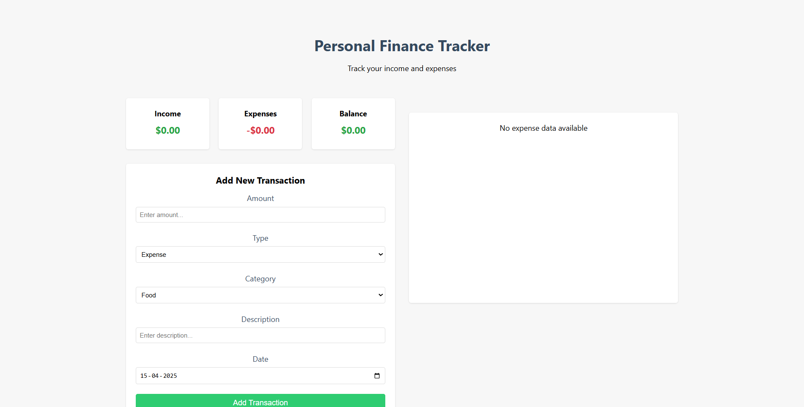
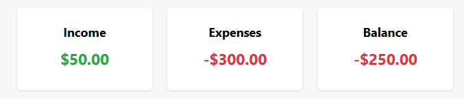
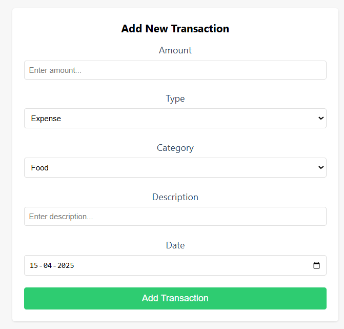
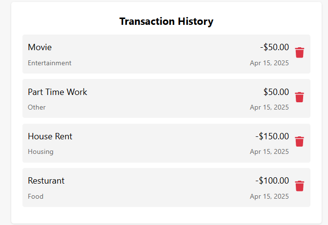
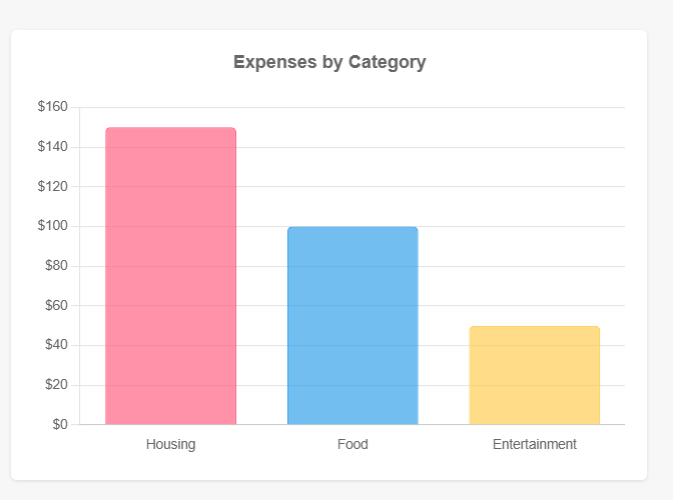

# Personal Finance Tracker

A full-stack web application for tracking personal income and expenses, built with the MERN stack (MongoDB, Express.js, React, Node.js).

🔗 **Live Demo:** [https://yardstick-internship-assesment.onrender.com/](https://yardstick-internship-assesment.onrender.com/)



## Features

- Add and delete income/expense transactions
- Categorize transactions by type (income/expense) and category
- Real-time balance calculation and updates
- Visual representation of expenses by category using Chart.js
- Responsive design for all devices
- Form validation and error handling
- Date-based transaction organization
- Interactive transaction history with delete functionality

## Tech Stack

### Backend
- Node.js & Express.js
- MongoDB & Mongoose
- RESTful API architecture
- Environment variables configuration
- CORS enabled
- Morgan for logging

### Frontend
- React (Create React App)
- Chart.js for data visualization
- Date-fns for date formatting
- Axios for API requests
- Modern ES6+ JavaScript
- CSS3 with Flexbox/Grid
- Responsive design

## Prerequisites

- Node.js 
- MongoDB (local installation or MongoDB Atlas account)

## Installation

1. Clone the repository:
```bash
git clone https://github.com/Irfan140/Yardstick-internship-assesment.git
cd Yardstick-internship-assesment
```

2. Install server dependencies:
```bash
cd server
npm install
```

3. Install client dependencies:
```bash
cd ../client
npm install
```

4. Configure environment variables:

Create and setup a `.env` file in the server directory:
```env
PORT=
MONGO_URI=
```

Create and setup a `.env` file in the client directory:
```env
REACT_APP_API_URL=
```

## Running the Application

1. Start MongoDB service (if using local MongoDB)

2. Start the server:
```bash
cd server
npm run dev
```

3. Start the client (in a new terminal):
```bash
cd client
npm start
```

The application will be available at `http://localhost:3000`

## Data Models

### Transaction
```javascript
{
  amount: Number,
  description: String,
  category: String (enum),
  type: String (enum: ['expense', 'income']),
  date: Date,
  timestamps: true
}
```

### Categories
- Food
- Transportation
- Housing
- Utilities
- Entertainment
- Shopping
- Healthcare
- Other

## Features in Detail

### Balance Calculation
- Real-time calculation of total income
- Real-time calculation of total expenses
- Automatic balance updates
- Color-coded positive/negative balances

### Transaction Management
- Add new transactions with amount, type, category, and date
- Delete existing transactions
- View transaction history
- Sort transactions by date

### Data Visualization
- Bar chart showing expenses by category
- Color-coded transaction types
- Responsive chart sizing
- Currency formatting


## License

This project is licensed under the MIT License.

## Screenshots

### Main Dashboard


### Add Transaction


### Transaction History


### Expense Chart
 